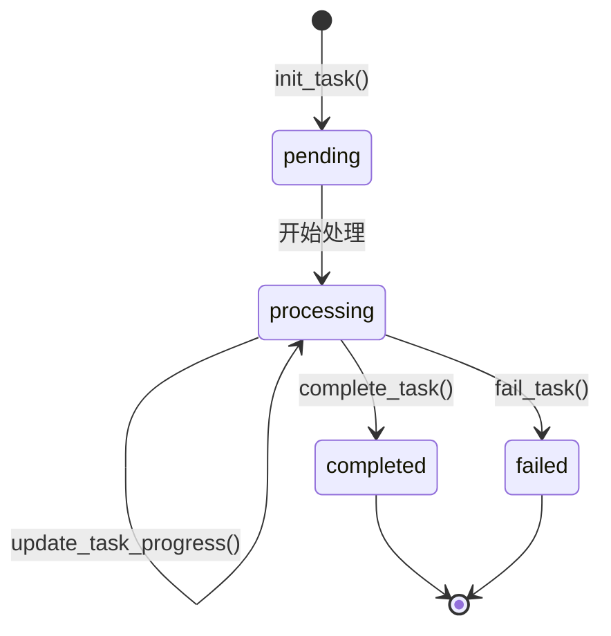

# Video2Note 后端服务

> **核心功能**: 将录屏视频自动提取为 PPT 幻灯片 + 语音转文字字幕

---

## 目录结构

```text
backend/
├── app/
│   ├── __init__.py
│   ├── main.py                  # FastAPI 入口，lifespan 初始化模型
│   ├── api/
│   │   └── v1/
│   │       └── endpoints.py     # API 路由：上传视频、查询任务状态
│   ├── core/
│   │   ├── config.py            # 全局配置 (路径定义)
│   │   └── task_manager.py      # 任务状态管理 (内存存储)
│   ├── services/
│   │   ├── video_service.py     # 视频处理核心 (裁剪+PPT提取)
│   │   ├── audio_service.py     # 语音转录 (FunASR本地+Gemini纠错)
│   │   └── files_service.py     # 文件清理工具
│   └── utils/
│       └── __init__.py
├── output/                      # 任务输出目录 (按 task_id 组织)
│   └── {task_id}/
│       ├── cropped_video/       # 裁剪后的视频
│       ├── debug_images/        # 调试用的边缘检测图
│       ├── ppt_images/          # PPT 页面截图
│       ├── ppt_output/          # 最终 PPTX 文件
│       └── transcripts/         # 转录文本文件
├── temp/                        # 临时上传文件 (处理完自动删除)
├── requirements.txt
└── server.py                    # (备用) 独立启动脚本
```

---

## 核心处理流程

```mermaid
flowchart TD
    A[前端上传视频] --> B["POST /api/v1/tasks/upload"]
    B --> C[生成 task_id, 保存临时文件]
    C --> D[后台任务队列]
    D --> E["VideoService.process()"]
    
    E --> F["1. 裁剪视频"]
    F --> |定位PPT区域| G["_locate_ppt_region()"]
    G --> |OpenCV边缘检测| H["_crop_video()"]
    
    H --> I["2. 提取PPT关键帧"]
    I --> |滑动窗口算法| J["_extract_frames_and_create_ppt()"]
    J --> |SSIM相似度对比| K[生成 PPTX]
    
    K --> L{enable_transcription?}
    L --> |Yes| M["3. 语音转录"]
    M --> N["FunASR 本地推理"]
    N --> O["Gemini 纠错"]
    O --> P[保存 .txt]
    
    L --> |No| Q[跳过转录]
    
    P --> R[complete_task()]
    Q --> R
    R --> S["GET /api/v1/tasks/{task_id}/status"]
    S --> T[前端轮询获取结果]
```

---

## API 端点

### 1. 上传视频

```http
POST /api/v1/tasks/upload
Content-Type: multipart/form-data
```

| 参数 | 类型 | 必填 | 说明 |
|------|------|------|------|
| `file` | File | ✅ | 视频文件 (.mp4, .mov, .avi, .mkv) |
| `enable_transcription` | bool | ❌ | 是否启用语音转文字 (默认 `false`) |

**响应示例**:
```json
{
    "task_id": "5b0a3181-c9a2-4db0-b731-770f55482bf9",
    "status": "processing",
    "message": "任务已提交"
}
```

---

### 2. 查询任务状态

```http
GET /api/v1/tasks/{task_id}/status
```

**响应示例 (处理中)**:
```json
{
    "status": "processing",
    "progress": 65,
    "message": "正在生成PPT: 65%",
    "result_url": null,
    "error": null
}
```

**响应示例 (已完成)**:
```json
{
    "status": "completed",
    "progress": 100,
    "message": "任务完成",
    "result_url": "/static/{task_id}/ppt_output/{task_id}.pptx",
    "transcript_url": "/static/{task_id}/transcripts/{task_id}.txt"
}
```

---

## `enable_transcription` 逻辑详解

### 触发条件

前端上传时传入 `enable_transcription=true`，后端在 PPT 提取完成后会额外执行语音转录流程。

### 流程细节

```python
# video_service.py 中的关键代码
def process(self, input_video_path: Path, enable_transcription: bool = False):
    # 1. 裁剪视频 → 定位PPT区域
    cropped_video_path = self._crop_video(input_video_path)
    
    # 2. 提取关键帧 → 生成PPTX
    ppt_path = self._extract_frames_and_create_ppt(cropped_video_path)
    
    # 3. [可选] 语音转录
    transcript_path = None
    if enable_transcription:
        # 调用 audio_service 单例
        transcript_text = get_audio_transcriber().transcribe_video(input_video_path)
        
        if transcript_text:
            transcript_path = self.transcripts_dir / f"{self.output_guid}.txt"
            with open(transcript_path, "w", encoding="utf-8") as f:
                f.write(transcript_text)
```

### 转录引擎

| 阶段 | 技术栈 | 说明 |
|------|--------|------|
| **音频提取** | `moviepy` | 从视频提取 16kHz 单声道 WAV |
| **本地推理** | `FunASR` (CUDA) | 使用 `speech_seaco_paraformer_large` 模型本地识别 |
| **云端纠错** | `Gemini 2.5 Flash` | 修正同音错别字和标点 |

### 性能注意事项

> [!WARNING]
> 转录流程**极度耗时**，一段 30 分钟视频可能需要 5-10 分钟处理时间。
> - FunASR 首次运行会自动下载约 1-2GB 模型权重
> - 需要 NVIDIA GPU + CUDA 环境

---

## 任务状态流转



| 状态 | 说明 |
|------|------|
| `pending` | 任务已创建，等待处理 |
| `processing` | 正在处理中，前端可轮询 `progress` |
| `completed` | 处理完成，`result_url` 可用 |
| `failed` | 处理失败，查看 `error` 字段 |

---

## PPT 提取算法

采用 **滑动窗口一致性检测 (Sliding Window Consensus)** 策略：

1. **跳帧采样**: 每 15 帧采样一次 (约 0.5 秒)
2. **缓冲区检测**: 最近 10 次采样放入滑动窗口
3. **连续性判断**: 必须连续 3 次采样画面相似度 > 0.96 才认为是静止页面
4. **全局去重**: 与上一张已保存的页面对比，避免重复提取

```python
# 关键参数
frame_interval = 15          # 采样间隔
buffer_size = 10             # 滑动窗口大小
consistency_count = 3        # 连续一致次数阈值
similarity_threshold = 0.96  # SSIM 相似度阈值
```

---

## 快速启动

```powershell
# 1. 激活虚拟环境
cd backend
.\.venv\Scripts\Activate.ps1

# 2. 安装依赖
pip install -r requirements.txt

# 3. 配置环境变量 (如需转录功能)
# 创建 .env 文件，添加:
# GEMINI_API_KEY=your_api_key_here

# 4. 启动服务
python -m uvicorn app.main:app --reload
```

服务启动后访问: http://127.0.0.1:8000/docs 查看 Swagger 文档

---

## 依赖说明

| 包名 | 用途 |
|------|------|
| `fastapi` | Web 框架 |
| `uvicorn` | ASGI 服务器 |
| `python-multipart` | 文件上传 |
| `opencv-python` | 视频处理、边缘检测 |
| `scikit-image` | SSIM 相似度计算 |
| `python-pptx` | PPTX 生成 |
| `moviepy` | 音频提取 |
| `funasr` | 本地语音识别 (需 CUDA) |
| `google-genai` | Gemini API 调用 |

---

---

## 常见问题排查 (Troubleshooting)

### 1. PaddleOCR 初始化失败: `[WinError 127] 找不到指定的程序`

**现象**: 启动时报错 `Error loading ...\cudnn_cnn64_9.dll or one of its dependencies`

**核心原因**: Windows 系统缺少 NVIDIA cuDNN 必须的 `zlibwapi.dll` 库。

**解决方案 (推荐)**:

1. **下载依赖**: [zlib123dllx64.zip](http://www.winimage.com/zLibDll/zlib123dllx64.zip)
2. **解压文件**: 提取 `zlibwapi.dll`。
3. **复制到 cuDNN 目录 (最稳妥)**:
   将 dll 文件复制到:
   `C:\Users\wwwlu\AppData\Local\Programs\Python\Python311\Lib\site-packages\nvidia\cudnn\bin\`
   
   *(注: 你的 Python 路径可能不同，请复制到报错信息中显示的路径对应的 bin 目录下)*

4. **重启服务**: 必须关闭并重新运行 uvicorn。

---

> [!WARNING]
> **关于虚拟环境 (.venv)**
> 
> 检测到你的 `.venv` 目录可能是从其他电脑或目录直接复制过来的，导致 `pip` 命令失效。
> 建议删除 `.venv` 文件夹，并重新运行以下命令重建环境：
> ```powershell
> python -m venv .venv
> .\.venv\Scripts\Activate.ps1
> pip install -r backend/requirements.txt
> ```

