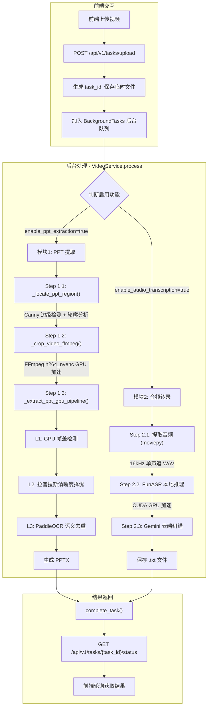
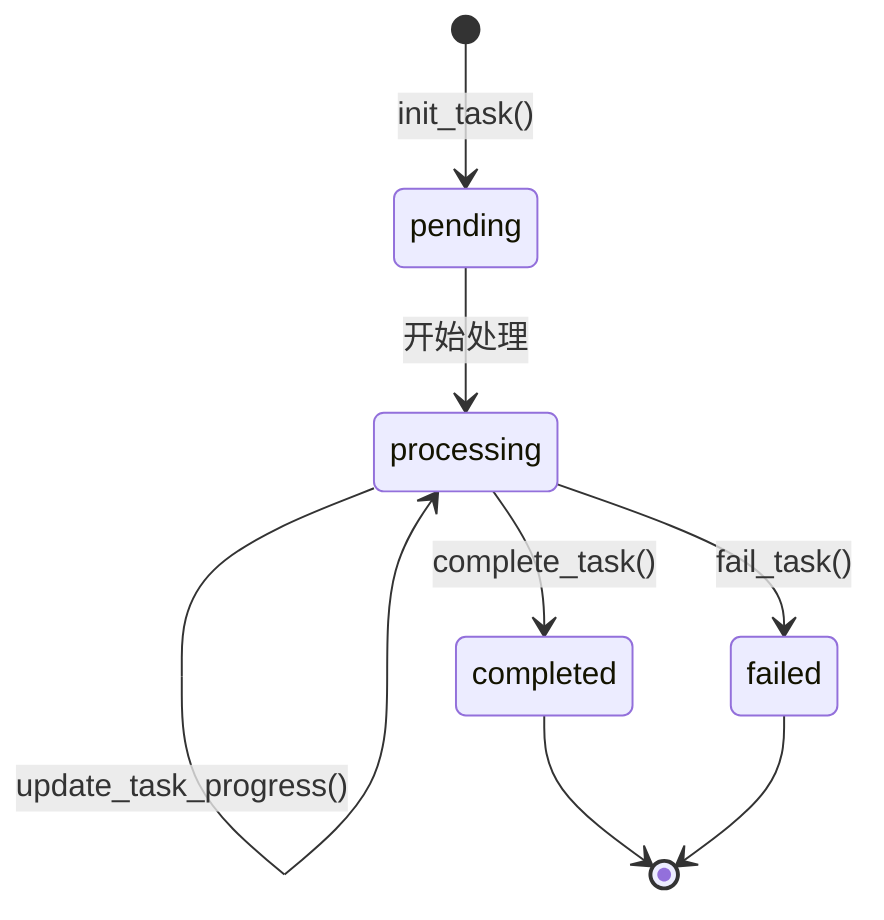

# Video2Note 后端服务

> **核心能力**: 录屏视频 → PPT 幻灯片 + 语音转文字

采用 **GPU 全链路加速** 架构，实现三层漏斗 PPT 提取与本地语音识别。

---

## 目录

- [项目结构](#项目结构)
- [核心处理流程](#核心处理流程)
- [API 端点详解](#api-端点详解)
- [三层漏斗 PPT 提取算法](#三层漏斗-ppt-提取算法)
- [音频转录模块](#音频转录模块)
- [任务状态管理](#任务状态管理)
- [快速启动](#快速启动)
- [环境依赖](#环境依赖)
- [配置说明](#配置说明)
- [常见问题排查](#常见问题排查)

---

## 项目结构

```text
backend/
├── app/
│   ├── __init__.py
│   ├── main.py                          # FastAPI 入口，lifespan 初始化模型
│   ├── api/
│   │   └── v1/
│   │       └── endpoints.py             # API 路由：上传视频、查询任务状态
│   ├── core/
│   │   ├── config.py                    # 全局配置 (路径定义、允许的文件格式)
│   │   └── task_manager.py              # 任务状态管理 (内存存储)
│   ├── services/
│   │   ├── video_service.py             # 视频处理核心 (裁剪+三层漏斗PPT提取)
│   │   ├── gpu_frame_processor.py       # L1+L2 GPU 帧处理器
│   │   ├── ocr_deduper.py               # L3 OCR 语义去重
│   │   ├── audio_service.py             # 语音转录 (FunASR本地+Gemini纠错)
│   │   └── files_service.py             # 文件清理工具
│   └── utils/
│       └── __init__.py
├── output/                              # 任务输出目录 (按 task_id 组织)
│   └── {task_id}/
│       ├── cropped_video/               # 裁剪后的视频
│       ├── debug_images/                # 调试用的边缘检测图
│       ├── ppt_images/                  # PPT 页面截图
│       ├── ppt_output/                  # 最终 PPTX 文件
│       └── transcripts/                 # 转录文本文件
├── temp/                                # 临时上传文件 (处理完自动删除)
├── libs/                                # [可选] 本地 DLL 依赖 (如 zlibwapi.dll)
├── requirements.txt
└── server.py                            # (备用) 独立启动脚本
```

---

## 核心处理流程



---

## API 端点详解

### 1. 上传视频创建任务

```http
POST /api/v1/tasks/upload
Content-Type: multipart/form-data
```

#### 请求参数

| 参数名 | 类型 | 必填 | 默认值 | 说明 |
|--------|------|------|--------|------|
| `file` | File | ✅ | - | 视频文件 (支持 .mp4, .mov, .avi, .mkv, .m4s) |
| `enable_ppt_extraction` | bool | ❌ | `true` | 是否启用 PPT 提取功能 |
| `enable_audio_transcription` | bool | ❌ | `false` | 是否启用语音转文字功能 |

> [!IMPORTANT]
> 两个功能开关 **至少选择一项**，否则返回 `400` 错误。

#### 响应示例

```json
{
    "task_id": "5b0a3181-c9a2-4db0-b731-770f55482bf9",
    "status": "processing",
    "message": "任务已提交"
}
```

#### 后端处理逻辑

```python
# endpoints.py 关键代码
@router.post("/tasks/upload")
async def upload_video(
    background_tasks: BackgroundTasks,
    file: UploadFile = File(...),
    enable_ppt_extraction: bool = Form(True),      # 默认启用 PPT 提取
    enable_audio_transcription: bool = Form(False) # 默认禁用转录
):
    # 参数校验: 至少选择一项功能
    if not enable_ppt_extraction and not enable_audio_transcription:
        raise HTTPException(status_code=400, detail="至少选择一项处理功能")
    
    task_id = str(uuid.uuid4())
    init_task(task_id)
    
    # 保存临时文件
    temp_file_path = TEMP_DIR / f"{task_id}_{file.filename}"
    # ...
    
    # 加入后台队列，两个功能模块完全独立
    background_tasks.add_task(
        run_video_task, 
        task_id, 
        temp_file_path, 
        enable_ppt_extraction,
        enable_audio_transcription
    )
```

---

### 2. 查询任务状态

```http
GET /api/v1/tasks/{task_id}/status
```

#### 响应示例 (处理中)

```json
{
    "status": "processing",
    "progress": 65,
    "message": "OCR 去重检查: 第 12 个候选帧",
    "result_url": null,
    "error": null
}
```

#### 响应示例 (已完成)

```json
{
    "status": "completed",
    "progress": 100,
    "message": "任务完成",
    "result_url": "/static/{task_id}/ppt_output/{task_id}.pptx",
    "transcript_url": "/static/{task_id}/transcripts/{task_id}.txt"
}
```

#### 响应字段说明

| 字段 | 类型 | 说明 |
|------|------|------|
| `status` | string | 任务状态: `pending` / `processing` / `completed` / `failed` |
| `progress` | int | 处理进度百分比 (0-100) |
| `message` | string | 当前处理阶段描述 |
| `result_url` | string | PPT 文件下载 URL (完成后可用) |
| `transcript_url` | string | 转录文件下载 URL (启用转录时可用) |
| `error` | string | 错误信息 (失败时可用) |

---

## 三层漏斗 PPT 提取算法

### 架构总览

```
┌─────────────────────────────────────────────────────────────┐
│                    三层漏斗 PPT 提取流程                      │
├─────────────────────────────────────────────────────────────┤
│                                                             │
│   输入视频                                                   │
│      │                                                      │
│      ▼                                                      │
│   ┌─────────────────────────────────────────┐               │
│   │ L1 物理层: GPU 帧差检测 (场景分割)         │               │
│   │   - PyTorch MAD 算法                     │               │
│   │   - diff_threshold: 0.12                 │               │
│   │   - min_scene_duration: 1.5s             │               │
│   └──────────────┬──────────────────────────┘               │
│                  │ 候选场景片段                              │
│                  ▼                                          │
│   ┌─────────────────────────────────────────┐               │
│   │ L2 质量层: 拉普拉斯清晰度择优              │               │
│   │   - Laplacian Variance                   │               │
│   │   - 场景内选最清晰帧                      │               │
│   └──────────────┬──────────────────────────┘               │
│                  │ 冠军帧列表                               │
│                  ▼                                          │
│   ┌─────────────────────────────────────────┐               │
│   │ L3 语义层: PaddleOCR 文本去重             │               │
│   │   - similarity_threshold: 90%            │               │
│   │   - SequenceMatcher 模糊匹配             │               │
│   └──────────────┬──────────────────────────┘               │
│                  │ 去重后页面                               │
│                  ▼                                          │
│   生成 PPTX                                                 │
│                                                             │
└─────────────────────────────────────────────────────────────┘
```

---

### L1 物理层: GPU 帧差检测

**位置**: `gpu_frame_processor.py` → `GPUFrameProcessor` 类

**核心算法**: Mean Absolute Difference (MAD)

```python
def compute_frame_difference(self, frame1: torch.Tensor, frame2: torch.Tensor) -> float:
    """
    L1 物理层核心: 计算两帧之间的差异度
    
    使用 MAD 算法:
    - 计算两帧像素级绝对差值的均值
    - 返回 0-1 之间的差异分数
    
    Why MAD 而非 SSIM?
    - MAD 在 GPU 上计算极快 (单次张量运算)
    - 对于场景切换检测，MAD 的敏感度足够
    - SSIM 虽然更精确，但计算复杂度高
    """
    diff = torch.abs(frame1 - frame2).mean().item()
    return diff
```

**关键参数**:

| 参数 | 默认值 | 说明 |
|------|--------|------|
| `diff_threshold` | 0.12 | 帧间差异阈值，超过此值视为场景切换 |
| `min_scene_duration` | 1.5 秒 | 场景最短持续时间，用于过滤动态视频片段 |
| `sample_fps` | 4 | 采样帧率 (每秒取 4 帧) |

**参数调优建议**:

| 场景类型 | `diff_threshold` 建议值 |
|----------|-------------------------|
| 纯静态 PPT | 0.08 - 0.12 |
| 含动画/渐变效果 | 0.15 - 0.20 |
| 含嵌入视频片段 | 0.20 - 0.25 |

---

### L2 质量层: 拉普拉斯清晰度择优

**位置**: `gpu_frame_processor.py` → `compute_laplacian_sharpness()`

**核心算法**: Laplacian Variance

```python
def compute_laplacian_sharpness(self, frame: torch.Tensor) -> float:
    """
    L2 质量层核心: 计算帧的清晰度得分
    
    原理:
    1. 使用拉普拉斯算子对图像进行卷积 (检测边缘)
    2. 计算卷积结果的方差
    3. 方差越大，说明边缘越锐利，图像越清晰
    
    Why Laplacian Variance?
    - 对焦距/模糊变化非常敏感
    - 能有效区分清晰帧和运动模糊帧
    """
    # 标准 3x3 拉普拉斯算子
    laplacian_kernel = [[0, 1, 0],
                        [1, -4, 1],
                        [0, 1, 0]]
    
    laplacian = conv2d(frame, laplacian_kernel)
    variance = laplacian.var()
    return variance
```

**工作流程**:

1. 对场景内每一采样帧计算清晰度分数
2. 选取分数最高的帧作为该场景的"冠军帧"
3. 冠军帧包含帧索引、清晰度分数、场景起止位置

---

### L3 语义层: PaddleOCR 文本去重

**位置**: `ocr_deduper.py` → `OCRDeduper` 类

**核心算法**: SequenceMatcher (Gestalt 模式匹配)

```python
def calculate_similarity(self, text1: str, text2: str) -> float:
    """
    计算两段文本的相似度
    
    Why SequenceMatcher?
    - 对字符替换、插入、删除有较好容忍度
    - 能处理 OCR 识别误差（如 "O" vs "0"）
    - 计算效率高，无需额外依赖
    """
    # 预处理: 去除空白字符，统一大小写
    text1_clean = "".join(text1.lower().split())
    text2_clean = "".join(text2.lower().split())
    
    return SequenceMatcher(None, text1_clean, text2_clean).ratio()
```

**关键参数**:

| 参数 | 默认值 | 说明 |
|------|--------|------|
| `similarity_threshold` | 0.90 | 文本相似度阈值，超过则视为重复页面 |

**去重逻辑**:

```python
def is_duplicate(self, frame) -> tuple[bool, str]:
    """
    判断当前帧是否与上一张保存的页面重复
    
    核心去重逻辑:
    1. 提取当前帧文本 (PaddleOCR)
    2. 与缓存的上一页文本比对
    3. 相似度超过阈值 (90%) 则判定为重复
    """
    current_text = self.extract_text(frame)
    similarity = self.calculate_similarity(self._last_saved_text, current_text)
    return similarity > self.similarity_threshold, current_text
```

---

### 视频裁剪预处理

**位置**: `video_service.py` → `_locate_ppt_region()` 和 `_crop_video_ffmpeg()`

#### Step 1: PPT 区域定位

```python
def _locate_ppt_region(self, video_path: Path) -> tuple | None:
    """
    使用边缘检测定位视频中的 PPT 区域
    
    策略:
    - 在视频 20%/40%/60% 位置各采样一帧
    - 使用 Canny 边缘检测 + 轮廓分析
    - 返回最大四边形区域的 bounding box (x, y, w, h)
    
    筛选条件:
    - 轮廓必须是 4 边形
    - 面积占比 > 10%
    """
```

**调试输出**: 每次定位会在 `debug_images/` 目录生成调试图像:

| 文件名 | 内容 |
|--------|------|
| `0_original.jpg` | 原始采样帧 |
| `1_gray.jpg` | 灰度图 |
| `2_edged.jpg` | Canny 边缘检测结果 |
| `3_final_region.jpg` | 标记定位区域的最终结果 |

#### Step 2: FFmpeg 硬件加速裁剪

```python
def _crop_video_ffmpeg(self, input_path: Path, bbox: tuple) -> Path | None:
    """
    使用 FFmpeg NVENC 硬件加速裁剪视频
    
    核心优势:
    - GPU 解码 + GPU 编码，比 OpenCV CPU 快 5-10 倍
    - 输出质量可控 (CQ 模式)
    
    NVENC 兼容性处理:
    - bbox 宽高向下对齐到偶数 (NVENC 要求)
    - 失败时自动回退到 CPU 裁剪
    """
    cmd = [
        "ffmpeg",
        "-y",
        "-i", str(input_path),
        "-vf", f"crop={w}:{h}:{x}:{y}",
        "-c:v", "h264_nvenc",          # NVIDIA 硬件编码
        "-pix_fmt", "yuv420p",          # 像素格式
        "-preset", "p1",                # 最快预设 (p1-p7)
        "-cq", "23",                    # 质量控制 (18-28)
        "-c:a", "copy",                 # 音频直接复制
        str(output_path)
    ]
```

---

## 音频转录模块

**位置**: `audio_service.py` → `AudioTranscriber` 类

### 架构说明

```
┌─────────────────────────────────────────────────────────────┐
│                    音频转录处理流程                          │
├─────────────────────────────────────────────────────────────┤
│                                                             │
│   输入视频                                                   │
│      │                                                      │
│      ▼                                                      │
│   ┌─────────────────────────────────────────┐               │
│   │ Step 1: 提取音频 (moviepy)               │               │
│   │   - 输出: 16kHz 单声道 WAV               │               │
│   │   - 格式: PCM signed 16-bit              │               │
│   └──────────────┬──────────────────────────┘               │
│                  │                                          │
│                  ▼                                          │
│   ┌─────────────────────────────────────────┐               │
│   │ Step 2: FunASR 本地推理 (CUDA)           │               │
│   │   - 模型: speech_seaco_paraformer_large  │               │
│   │   - 特性: 支持热词、长音频分段            │               │
│   └──────────────┬──────────────────────────┘               │
│                  │ raw_text                                 │
│                  ▼                                          │
│   ┌─────────────────────────────────────────┐               │
│   │ Step 3: Gemini 云端纠错                  │               │
│   │   - 模型: gemini-2.5-flash               │               │
│   │   - 任务: 修正错别字、标点、通顺性        │               │
│   └──────────────┬──────────────────────────┘               │
│                  │ corrected_text                           │
│                  ▼                                          │
│   保存 .txt 文件                                            │
│                                                             │
└─────────────────────────────────────────────────────────────┘
```

### 模型配置

```python
# FunASR 模型配置
model_config = {
    "model": "iic/speech_seaco_paraformer_large_asr_nat-zh-cn-16k-common-vocab8404-pytorch",
    "model_revision": "v2.0.4",
    "vad_model": "iic/speech_fsmn_vad_zh-cn-16k-common-pytorch",      # 语音活动检测
    "vad_model_revision": "v2.0.4",
    "punc_model": "iic/punc_ct-transformer_cn-en-common-vocab471067-large",  # 标点恢复
    "punc_model_revision": "v2.0.4",
    "spk_model": "iic/speech_campplus_sv_zh-cn_16k-common",           # 说话人识别
    "spk_model_revision": "v2.0.2",
}

AudioTranscriber._model = AutoModel(**model_config, device="cuda", disable_update=True)
```

### Gemini 纠错 Prompt

```python
prompt = (
    "你是一个专业的会议记录员。请阅读以下机器识别的文本，"
    "修正其中的同音错别字、标点错误和语句不通顺的地方。"
    "保持原意，不要进行总结或摘要，直接输出修正后的全文：\n\n"
    f"{raw_text}"
)
```

### 关键参数

| 参数 | 值 | 说明 |
|------|-----|------|
| 音频采样率 | 16000 Hz | FunASR 推荐格式 |
| 音频声道 | 单声道 (mono) | 语音识别标准 |
| batch_size_s | 300 秒 | 每次处理 5 分钟音频 |
| hotword | `'Video2Note'` | 热词增强 |

> [!WARNING]
> **性能注意事项**
> - FunASR 首次运行会自动下载约 **1-2GB** 模型权重
> - 转录流程**极度耗时**，30 分钟视频可能需要 5-10 分钟处理
> - 需要 **NVIDIA GPU + CUDA 12.x** 环境

---

## 任务状态管理

**位置**: `task_manager.py`

### 状态流转图



### 状态说明

| 状态 | 说明 | 前端行为 |
|------|------|----------|
| `pending` | 任务已创建，等待处理资源 | 显示"排队中" |
| `processing` | 正在处理中 | 轮询 `progress` 显示进度条 |
| `completed` | 处理完成 | 显示下载按钮 |
| `failed` | 处理失败 | 显示 `error` 错误信息 |

### 进度区间分配

| 功能组合 | PPT 提取进度 | 音频转录进度 |
|----------|--------------|--------------|
| 仅 PPT | 0% - 100% | - |
| 仅音频 | - | 0% - 100% |
| 两者都启用 | 0% - 85% | 85% - 100% |

---

## 快速启动

### 1. 环境准备

```powershell
# 进入后端目录
cd backend

# 创建虚拟环境 (如不存在)
python -m venv .venv

# 激活虚拟环境
.\.venv\Scripts\Activate.ps1
```

### 2. 安装依赖

```powershell
# 安装基础依赖
pip install -r requirements.txt

# PyTorch CUDA 版本 (如需手动安装)
pip install torch torchaudio --index-url https://download.pytorch.org/whl/cu124

# PaddlePaddle GPU 版本 (如需手动安装)
pip install paddlepaddle-gpu -i https://mirror.baidu.com/pypi/simple
```

### 3. 配置环境变量

在 `backend/` 目录下创建 `.env` 文件:

```env
# Gemini API 密钥 (用于转录纠错，可选)
GEMINI_API_KEY=your_api_key_here
```

### 4. 启动服务

```powershell
# 开发模式启动 (支持热重载)
python -m uvicorn app.main:app --reload --host 0.0.0.0 --port 8000
```

服务启动后访问:
- API 文档: http://127.0.0.1:8000/docs
- 根路径: http://127.0.0.1:8000

> [!NOTE]
> 首次启动时，FunASR 会自动下载模型权重 (约 1-2GB)，请耐心等待。
> 下载完成后后续启动会直接加载本地缓存。

---

## 环境依赖

### Python 包

| 包名 | 版本建议 | 用途 |
|------|----------|------|
| `fastapi` | 最新 | Web 框架 |
| `uvicorn` | 最新 | ASGI 服务器 |
| `python-multipart` | 最新 | 文件上传支持 |
| `python-dotenv` | 最新 | 环境变量管理 |
| `opencv-python` | 最新 | 视频处理、边缘检测 |
| `python-pptx` | 最新 | PPTX 生成 |
| `torch` | 2.x (CUDA 12.4) | GPU 张量计算 |
| `torchaudio` | 2.x | 音频处理 |
| `paddlepaddle-gpu` | 2.6+ | PaddleOCR 后端 |
| `paddleocr` | 3.x | OCR 文字识别 |
| `moviepy` | 2.x | 视频音频提取 |
| `funasr` | 最新 | 本地语音识别 |
| `modelscope` | 最新 | 模型下载管理 |
| `google-genai` | 最新 | Gemini API 调用 |

### 系统依赖

| 依赖 | 版本要求 | 说明 |
|------|----------|------|
| **Python** | 3.10 - 3.11 | 3.12 暂不支持部分深度学习库 |
| **CUDA** | 12.x | PyTorch 和 PaddlePaddle 需要 |
| **cuDNN** | 9.x | 深度学习加速 |
| **FFmpeg** | 6.x+ | 视频裁剪 (需加入 PATH) |

---

## 配置说明

### config.py 配置项

```python
# backend/app/core/config.py

# 后端根目录
BASE_DIR = Path(__file__).resolve().parent.parent.parent

# 临时文件夹 (上传时暂存，处理后自动清理)
TEMP_DIR = BASE_DIR / "temp"

# 输出文件夹 (按 task_id 组织)
OUTPUT_DIR = BASE_DIR / "output"

# 允许上传的视频格式
ALLOWED_EXTENSIONS = {".mp4", ".mov", ".avi", ".mkv", ".m4s"}
```

### 算法参数调优

| 文件 | 参数 | 默认值 | 调优建议 |
|------|------|--------|----------|
| `video_service.py` | `diff_threshold` | 0.12 | 提高以忽略动画效果 |
| `video_service.py` | `min_scene_duration` | 1.5s | 提高以过滤短暂动态 |
| `video_service.py` | `sample_fps` | 4 | 降低以节省算力 |
| `ocr_deduper.py` | `similarity_threshold` | 0.90 | 降低以保留更多页面 |

---

## 常见问题排查

### 1. PaddleOCR 初始化失败: `[WinError 127] 找不到指定的程序`

**现象**: 启动时报错 `Error loading ...cudnn_cnn64_9.dll or one of its dependencies`

**核心原因**: Windows 系统缺少 cuDNN 依赖的 `zlibwapi.dll` 库。

**解决方案**:

1. **下载依赖**: [zlib123dllx64.zip](http://www.winimage.com/zLibDll/zlib123dllx64.zip)
2. **解压文件**: 提取 `zlibwapi.dll`
3. **放置位置** (任选其一):
   - 复制到 cuDNN 目录: `C:\Users\{你的用户名}\AppData\Local\Programs\Python\Python311\Lib\site-packages\nvidia\cudnn\bin\`
   - 或创建 `backend/libs/` 目录并放入 (代码会自动加载)

4. **重启服务**: 必须关闭并重新运行 uvicorn

---

### 2. FFmpeg 裁剪失败: `returncode=3221225477`

**现象**: 日志显示 `ACCESS_VIOLATION (0xC0000005)` 或 FFmpeg 崩溃

**核心原因**: NVENC 硬件编码对输入尺寸有严格要求 (必须为偶数)

**代码中的解决方案** (已实现):

```python
# video_service.py 中的 bbox 修正逻辑
x = x if x % 2 == 0 else x - 1
y = y if y % 2 == 0 else y - 1
w = w if w % 2 == 0 else w - 1
h = h if h % 2 == 0 else h - 1
```

**如仍失败**: 服务会自动回退到 CPU 模式 (`_crop_video_cpu_fallback`)

---

### 3. 服务启动卡住 / 白屏

**现象**: 访问 `http://127.0.0.1:8000` 无响应

**可能原因**:
- FunASR 正在下载模型权重 (首次约需 5-10 分钟)
- 查看后端日志确认是否有 `Downloading` 输出

**解决方案**:
- 确保网络畅通 (需访问 modelscope.cn)
- 等待下载完成，日志会显示 `✅ FunASR 模型加载成功`

---

### 4. 虚拟环境 pip 命令失效

**现象**: `pip` 或 `python` 命令报错

**可能原因**: `.venv` 是从其他电脑复制过来的

**解决方案**:

```powershell
# 删除并重建虚拟环境
Remove-Item -Recurse -Force .venv
python -m venv .venv
.\.venv\Scripts\Activate.ps1
pip install -r requirements.txt
```

---

### 5. 转录结果为空

**排查步骤**:

1. 确认视频有音频轨道: `ffprobe your_video.mp4`
2. 检查 FunASR 是否正常加载: 日志应有 `✅ FunASR 模型加载成功 (CUDA)`
3. 检查 GEMINI_API_KEY 是否配置 (可选，不影响本地转录)

---

## 日志级别配置

```python
# main.py
import logging
logging.basicConfig(level=logging.INFO)  # 可改为 DEBUG 查看详细日志
```

---

## 版本历史

| 版本 | 日期 | 更新内容 |
|------|------|----------|
| v2.0 | 2025-12-31 | 重构 PPT 提取为三层漏斗模型，新增 PaddleOCR 语义去重 |
| v1.5 | 2025-12-31 | 解耦 PPT 提取与音频转录为独立模块 |
| v1.0 | 2025-12-30 | 初始版本，滑动窗口一致性检测 + FunASR 转录 |
