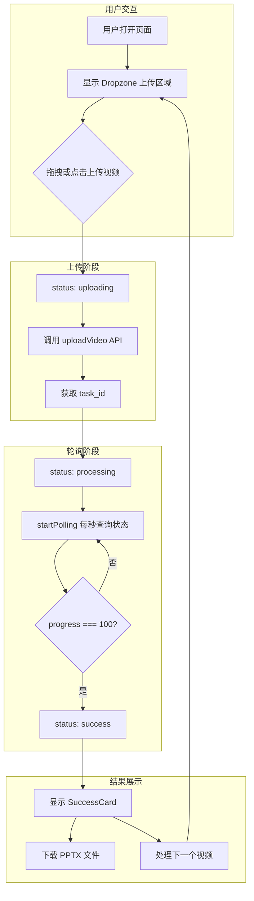

# Video2Note 前端

> **技术栈**: React 19 + Vite 7 + TailwindCSS 3 + Framer Motion

一个现代化的视频转 PPT 前端应用，提供拖拽上传、实时进度反馈和优雅的动画效果。

---

## 目录

- [项目结构](#项目结构)
- [技术栈详解](#技术栈详解)
- [核心功能流程](#核心功能流程)
- [组件架构](#组件架构)
- [API 服务层](#api-服务层)
- [状态管理](#状态管理)
- [样式系统](#样式系统)
- [快速启动](#快速启动)
- [构建部署](#构建部署)
- [配置说明](#配置说明)

---

## 项目结构

```text
frontend/
├── public/
│   └── vite.svg                    # 网站图标
├── src/
│   ├── assets/                     # 静态资源
│   ├── components/                 # React 组件
│   │   ├── Dropzone.jsx           # 拖拽上传区域
│   │   ├── ProcessingView.jsx     # 处理进度展示
│   │   └── SuccessCard.jsx        # 成功结果卡片
│   ├── services/
│   │   └── api.js                  # API 请求封装
│   ├── App.jsx                     # 主应用组件
│   ├── App.css                     # 应用样式
│   ├── index.css                   # 全局样式 (Tailwind)
│   └── main.jsx                    # 应用入口
├── index.html                      # HTML 模板
├── package.json                    # 依赖配置
├── vite.config.js                  # Vite 配置
├── tailwind.config.js             # TailwindCSS 配置
├── postcss.config.js              # PostCSS 配置
└── eslint.config.js               # ESLint 配置
```

---

## 技术栈详解

### 核心框架

| 依赖 | 版本 | 用途 |
|------|------|------|
| **React** | 19.2.0 | UI 框架 (使用最新 React 19 特性) |
| **Vite** | 7.2.4 | 构建工具 (极速 HMR) |
| **TailwindCSS** | 3.4.17 | 原子化 CSS 框架 |

### 动画与交互

| 依赖 | 版本 | 用途 |
|------|------|------|
| **Framer Motion** | 12.23.26 | 声明式动画库 |
| **Lucide React** | 0.562.0 | 图标库 (轻量级 SVG 图标) |

### 工具库

| 依赖 | 版本 | 用途 |
|------|------|------|
| **Axios** | 1.13.2 | HTTP 请求库 |
| **clsx** | 2.1.1 | 条件类名合并 |
| **tailwind-merge** | 3.4.0 | Tailwind 类名冲突解决 |

---

## 核心功能流程



### 状态流转

应用使用简单的 `useState` 管理四种状态：

| 状态 | 说明 | 显示组件 |
|------|------|----------|
| `idle` | 初始状态，等待用户上传 | `Dropzone` |
| `uploading` | 视频上传中 | 加载动画 |
| `processing` | 后端处理中 | `ProcessingView` |
| `success` | 处理完成 | `SuccessCard` |

---

## 组件架构

### 1. App.jsx - 主应用组件

**职责**: 状态管理、页面布局、组件调度

```jsx
// 核心状态
const [status, setStatus] = useState('idle');    // 应用状态
const [progress, setProgress] = useState(0);     // 处理进度
const [message, setMessage] = useState('');      // 状态消息
const [downloadUrl, setDownloadUrl] = useState(''); // 下载链接

// 轮询引用 (用于清理)
const pollingRef = useRef(null);
```

**核心函数**:

| 函数 | 功能 |
|------|------|
| `handleRealUpload(file)` | 处理文件上传，调用 API 并启动轮询 |
| `startPolling(taskId)` | 每秒轮询任务状态，更新 UI |
| `handleReset()` | 重置状态，处理下一个视频 |

---

### 2. Dropzone.jsx - 拖拽上传组件

**职责**: 提供拖拽和点击上传功能

**核心特性**:
- 支持拖拽 (drag & drop)
- 支持点击选择文件
- 限制只接受视频文件 (`accept="video/*"`)
- 悬停动画效果 (scale、gradient)

```jsx
<Dropzone onDrop={handleRealUpload} />
```

**样式亮点**:
```jsx
className={clsx(
    "rounded-3xl border-2 border-dashed border-slate-700",
    "hover:border-indigo-500/50 hover:bg-slate-900/80",
    "backdrop-blur-sm"  // 毛玻璃效果
)}
```

---

### 3. ProcessingView.jsx - 进度展示组件

**职责**: 显示处理进度和状态消息

**核心特性**:
- 圆形进度指示器 (旋转动画)
- 实时进度百分比
- 滚动消息轮播 (后端消息 + 默认消息)
- 进度条动画

**Props**:

| Prop | 类型 | 说明 |
|------|------|------|
| `progress` | number | 进度百分比 (0-100) |
| `message` | string | 后端返回的状态消息 |

**动画效果**:
```jsx
// 圆形旋转指示器
<motion.div
    animate={{ rotate: 360 }}
    transition={{ duration: 3, repeat: Infinity, ease: "linear" }}
/>

// 进度条平滑动画
<motion.div
    animate={{ width: `${progress}%` }}
    transition={{ ease: "linear" }}
/>
```

---

### 4. SuccessCard.jsx - 成功结果组件

**职责**: 显示处理成功页面，提供下载入口

**核心特性**:
- 成功动画 (scale + fade)
- PPT 下载按钮
- 视频下载按钮 (可选)
- "处理下一个" 重置按钮

**Props**:

| Prop | 类型 | 说明 |
|------|------|------|
| `onReset` | function | 重置回调 |
| `downloadUrl` | string | PPT 下载链接 |
| `videoUrl` | string | 视频下载链接 (可选) |

---

## API 服务层

**文件**: `src/services/api.js`

### 配置

```javascript
const BASE_URL = 'http://127.0.0.1:8000';

const api = axios.create({
    baseURL: BASE_URL,
});
```

### API 函数

#### 1. uploadVideo - 上传视频

```javascript
/**
 * 上传视频文件到后端
 * @param {File} file - 视频文件
 * @returns {Promise<{task_id: string}>}
 */
export const uploadVideo = async (file) => {
    const formData = new FormData();
    formData.append('file', file);

    const response = await api.post('/api/v1/tasks/upload', formData, {
        headers: { 'Content-Type': 'multipart/form-data' },
    });
    return response.data;
};
```

#### 2. checkStatus - 查询状态

```javascript
/**
 * 查询任务处理状态
 * @param {string} taskId - 任务 ID
 * @returns {Promise<{progress: number, message: string, result_url?: string}>}
 */
export const checkStatus = async (taskId) => {
    const response = await api.get(`/api/v1/tasks/${taskId}/status`);
    return response.data;
};
```

#### 3. getDownloadUrl - 获取下载链接

```javascript
/**
 * 生成完整下载 URL
 * @param {string} path - 相对路径
 * @returns {string} 完整 URL
 */
export const getDownloadUrl = (path) => {
    if (path.startsWith('http')) return path;
    return `${BASE_URL}${path}`;
};
```

---

## 状态管理

本项目使用 **React 原生状态管理** (useState + useRef)，无需引入 Redux/Zustand 等状态库。

### 状态定义

```jsx
// App.jsx
const [status, setStatus] = useState('idle');
const [progress, setProgress] = useState(0);
const [message, setMessage] = useState('');
const [downloadUrl, setDownloadUrl] = useState('');
const pollingRef = useRef(null);
```

### 轮询机制

```jsx
const startPolling = (taskId) => {
    pollingRef.current = setInterval(async () => {
        const data = await checkStatus(taskId);
        
        setProgress(data.progress || 0);
        if (data.message) setMessage(data.message);
        
        // 完成判断
        if (data.progress === 100 || data.result_url) {
            clearInterval(pollingRef.current);
            setDownloadUrl(getDownloadUrl(data.result_url));
            setStatus('success');
        }
    }, 1000); // 每秒轮询一次
};
```

### 清理机制

```jsx
useEffect(() => {
    return () => {
        if (pollingRef.current) clearInterval(pollingRef.current);
    };
}, []);
```

---

## 样式系统

### TailwindCSS 配置

**文件**: `tailwind.config.js`

```javascript
export default {
    content: [
        "./index.html",
        "./src/**/*.{js,ts,jsx,tsx}",
    ],
    theme: {
        extend: {},
    },
    plugins: [],
};
```

### 全局样式

**文件**: `src/index.css`

```css
@tailwind base;
@tailwind components;
@tailwind utilities;

@layer base {
    body {
        @apply bg-slate-950 text-slate-50 antialiased;
        @apply selection:bg-indigo-500/30 selection:text-indigo-200;
    }
}
```

### 主题色彩

| 用途 | 颜色类 |
|------|--------|
| 背景色 | `bg-slate-950` (深蓝黑) |
| 文字色 | `text-slate-50` (浅灰白) |
| 主题色 | `indigo-500` / `purple-500` |
| 成功色 | `green-500` |
| 边框色 | `slate-700` / `slate-800` |

### 动画效果

项目使用 Framer Motion 实现以下动画：

| 组件 | 动画效果 |
|------|----------|
| 页面标题 | fade in + slide up |
| Dropzone | scale + opacity |
| 状态切换 | AnimatePresence (exit 动画) |
| 进度圈 | 无限旋转 |
| 消息轮播 | slide up/down |

---

## 快速启动

### 前置要求

- **Node.js**: 18.x 或更高版本
- **npm**: 9.x 或更高版本

### 安装依赖

```powershell
cd frontend
npm install
```

### 开发模式

```powershell
npm run dev
```

默认访问地址: http://localhost:5173

### 连接后端

确保后端服务已启动:

```powershell
cd backend
python -m uvicorn app.main:app --reload
```

> **注意**: 前端默认连接 `http://127.0.0.1:8000`，如需修改请编辑 `src/services/api.js`

---

## 构建部署

### 生产构建

```powershell
npm run build
```

输出目录: `dist/`

### 预览构建结果

```powershell
npm run preview
```

### 部署方案

#### 方案 1: 静态文件托管

将 `dist/` 目录部署到任意静态文件服务器：
- Nginx
- Apache
- Vercel
- Netlify
- Cloudflare Pages

#### 方案 2: 与后端集成

将 `dist/` 目录复制到后端，由 FastAPI 静态服务：

```python
# backend/app/main.py
from fastapi.staticfiles import StaticFiles

# 挂载前端静态文件
app.mount("/", StaticFiles(directory="static", html=True), name="frontend")
```

---

## 配置说明

### Vite 配置

**文件**: `vite.config.js`

```javascript
import { defineConfig } from 'vite'
import react from '@vitejs/plugin-react'

export default defineConfig({
    plugins: [react()],
});
```

### 代理配置 (可选)

如需在开发时代理后端 API，添加以下配置：

```javascript
// vite.config.js
export default defineConfig({
    plugins: [react()],
    server: {
        proxy: {
            '/api': {
                target: 'http://127.0.0.1:8000',
                changeOrigin: true,
            },
        },
    },
});
```

---

## 可用脚本

| 命令 | 说明 |
|------|------|
| `npm run dev` | 启动开发服务器 (支持 HMR) |
| `npm run build` | 构建生产版本 |
| `npm run preview` | 预览生产构建 |
| `npm run lint` | 运行 ESLint 检查 |

---

## 常见问题

### 1. 跨域错误 (CORS)

**现象**: 控制台显示 `Access-Control-Allow-Origin` 错误

**解决方案**: 确保后端已配置 CORS 中间件:

```python
# backend/app/main.py
app.add_middleware(
    CORSMiddleware,
    allow_origins=["*"],
    allow_methods=["*"],
    allow_headers=["*"],
)
```

### 2. 上传失败

**现象**: 点击上传后显示"上传失败，请重试"

**排查**:
1. 检查后端是否启动: `http://127.0.0.1:8000`
2. 检查 Network 面板的请求状态
3. 确认 `api.js` 中的 `BASE_URL` 配置正确

### 3. 进度不更新

**现象**: 上传成功但进度一直为 0

**排查**:
1. 检查控制台是否有轮询错误
2. 确认后端任务状态 API 正常返回
3. 检查 `task_id` 是否正确传递

---

## 版本历史

| 版本 | 日期 | 更新内容 |
|------|------|----------|
| v1.0 | 2025-12-31 | 初始版本，支持视频上传与 PPT 下载 |
